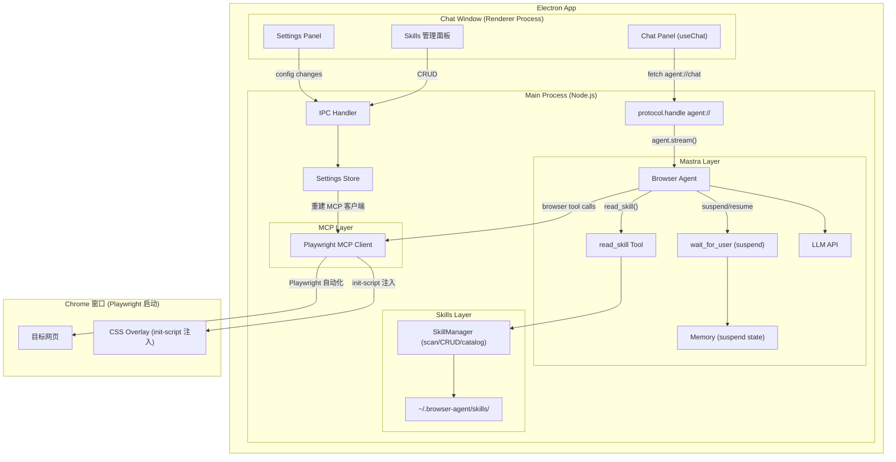
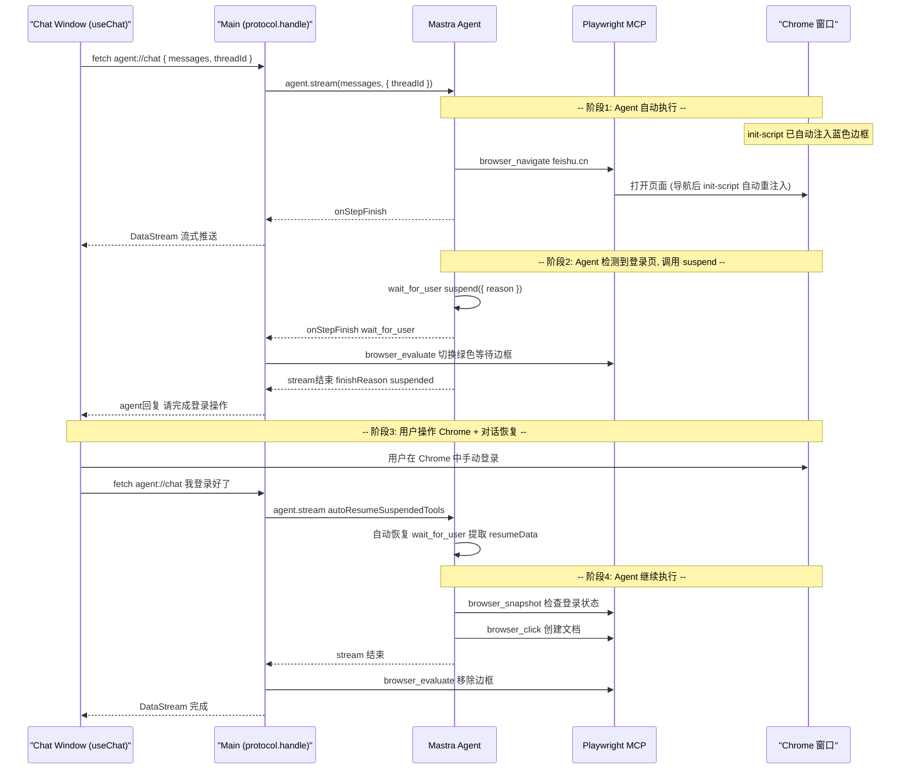
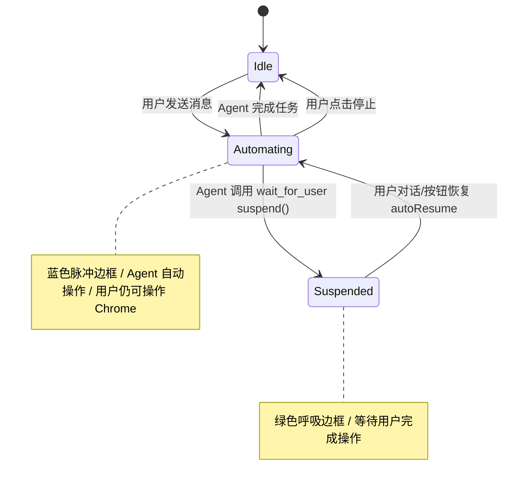

# 计划一：整体架构设计

> 从原始计划拆解而来。本文档聚焦全局视角：系统总览、分层架构、目录结构、技术栈与关键决策。

---

## 一、系统定位

将现有 Mastra + Playwright MCP 浏览器代理封装为 Electron 桌面应用。

**核心思路**：Electron 承载聊天 UI，**Playwright MCP 以默认模式启动独立 Chrome 窗口**（与 Cursor / Antigravity 相同），用户随时可操作 Chrome，Agent 也可主动暂停等待用户操作。Overlay 通过 `--init-script` 自动注入每个页面。

---

## 二、全局架构图



---

## 三、分层架构

| 层级 | 进程 | 职责 | 关键模块 |
|------|------|------|----------|
| **Renderer 层** | Renderer Process | UI 展示、用户交互 | Chat UI, Settings, Skills 管理 |
| **通信层** | Preload + Main | 进程间桥接 | protocol.handle (agent://), IPC, contextBridge |
| **Agent 层** | Main Process | AI 决策与编排 | Mastra Agent, Memory, Tools |
| **执行层** | Playwright MCP → Chrome | 浏览器自动化 | Playwright MCP Client (默认模式启动 Chrome) |

```
┌──────────────────────────────────────────────────────┐
│  Renderer 层: Electron Chat Window (React)           │
├──────────────────────────────────────────────────────┤
│  通信层: agent:// protocol + IPC + contextBridge     │
├──────────────────────────────────────────────────────┤
│  Agent 层: Mastra Agent + Memory + Tools             │
├──────────────────────────────────────────────────────┤
│  执行层: Playwright MCP → 独立 Chrome 窗口           │
│          + CSS Overlay (--init-script 注入)           │
└──────────────────────────────────────────────────────┘
```

---

## 四、核心数据流



---

## 五、状态机



---

## 六、项目目录结构

```
electron-browser-agent/
├── package.json
├── electron.vite.config.ts
├── electron-builder.yml
├── overlay-init.js                   # --init-script: 每个页面自动注入 overlay CSS
├── src/
│   ├── main/
│   │   ├── index.ts                  # 应用入口, protocol.handle 注册
│   │   ├── windows.ts                # Chat 窗口管理 (仅 Electron 窗口)
│   │   ├── ipc/
│   │   │   └── settings.ts           # 设置变更 IPC 处理
│   │   ├── agent/
│   │   │   ├── mastra.ts             # Mastra 实例
│   │   │   ├── browser-agent.ts      # Agent 配置
│   │   │   ├── browser-tools.ts      # MCP 客户端 (默认模式, 启动独立 Chrome)
│   │   │   ├── overlay.ts            # Overlay 控制 (browser_evaluate 切换状态)
│   │   │   └── wait-for-user.ts      # suspend() 工具
│   │   ├── skills/
│   │   │   ├── manager.ts
│   │   │   ├── read-skill.ts
│   │   │   └── types.ts
│   │   └── store/
│   │       └── settings.ts           # electron-store
│   │
│   ├── preload/
│   │   └── index.ts                  # contextBridge
│   │
│   └── renderer/
│       ├── index.html
│       ├── main.tsx
│       ├── App.tsx
│       ├── stores/
│       │   └── settings.ts
│       ├── components/
│       │   ├── chat/
│       │   │   ├── ChatPanel.tsx
│       │   │   ├── MessageBubble.tsx
│       │   │   ├── ActionCard.tsx
│       │   │   ├── ScreenshotCard.tsx
│       │   │   └── InputBar.tsx
│       │   ├── settings/
│       │   │   ├── SettingsPanel.tsx
│       │   │   ├── ModelConfig.tsx
│       │   │   └── BrowserConfig.tsx
│       │   ├── skills/
│       │   │   ├── SkillsPanel.tsx
│       │   │   ├── SkillEditor.tsx
│       │   │   └── SkillImport.tsx
│       │   └── layout/
│       │       ├── TitleBar.tsx
│       │       └── Sidebar.tsx
│       └── styles/
│           └── globals.css
```

---

## 七、技术栈总览

| 层级 | 技术 | 理由 |
|------|------|------|
| 桌面框架 | Electron 35+ | 承载聊天 UI |
| 构建工具 | electron-vite | Vite HMR，同时处理 main/preload/renderer |
| 前端框架 | React 19 + TypeScript | 生态成熟 |
| 聊天 UI | @ai-sdk/react + AI SDK Elements | useChat hook，内置工具调用追踪 |
| 通信层 | Electron `protocol.handle` | agent:// 自定义协议，无 localhost 端口 |
| 样式 | Tailwind CSS 4 | 快速迭代 |
| 状态管理 | Zustand (仅设置) | 聊天状态由 AI SDK 管理 |
| Agent 框架 | Mastra (@mastra/core) | Agent/Tool/Memory 全套 |
| 浏览器自动化 | @playwright/mcp (默认模式) | **直接启动独立 Chrome，开箱即用** |
| Overlay | --init-script + browser_evaluate | 每个页面自动注入 CSS，onStepFinish 动态切换 |
| 持久化 | electron-store (设置) + LibSQL (对话) | 各司其职 |
| 打包 | electron-builder | 跨平台 |

---

## 八、关键设计决策

### 决策 1: Playwright MCP 默认模式启动独立 Chrome

**选择**: 与 Cursor / Antigravity 相同，让 `@playwright/mcp` 以默认模式自行启动 Chrome 窗口。

| 维度 | 说明 |
|------|------|
| 优点 | **开箱即用**，零额外配置；真实 Chrome 环境；持久化 profile 保留登录态；经过大量产品验证的方案 |
| 缺点 | 外部 Chrome 进程需要管理；无法控制 Chrome 窗口外观 |
| 缓解 | `app.on('before-quit')` 清理进程；Chrome 窗口外观不影响功能 |
| 放弃方案 | Electron webview + CDP — `@playwright/mcp` 不能直接使用，需 `--cdp-endpoint` + CDP target 匹配，复杂度高 |

### 决策 2: 聊天通信 — `protocol.handle` 自定义协议

**选择**: 注册 `agent://` 自定义协议，`useChat` 通过 `fetch('agent://chat')` 直达 main process。

| 维度 | 说明 |
|------|------|
| 优点 | 无 localhost 端口暴露；标准 Request/Response API 与 AI SDK 兼容；原生 ReadableStream |
| 缺点 | DevTools Network 面板可见性有限 |
| 放弃方案 | localhost HTTP — 端口暴露；fetch → IPC — 流式维护成本高 |

### 决策 3: Overlay — `--init-script` + `browser_evaluate`

**选择**: 通过 `@playwright/mcp` 的 `--init-script` 参数在每个页面加载前自动注入 overlay CSS，`onStepFinish` 中通过 `browser_evaluate` 动态切换状态。

| 维度 | 说明 |
|------|------|
| 优点 | `--init-script` 是 Playwright MCP 官方功能，导航后**自动重注入**；无需手动检测导航；实现极简 |
| 缺点 | 页面 z-index 可能冲突（概率低）；新页面加载瞬间 overlay 可能闪烁 |
| 实现 | `overlay-init.js` 注入全局函数，`onStepFinish` 调用 `browser_evaluate` 切换模式/颜色 |

### 决策 4: 人机协作 — Mastra 原生 suspend/resume

**选择**: Mastra 内置 `suspend()` + `autoResumeSuspendedTools`，无需 IPC 侧信道。

| 维度 | 说明 |
|------|------|
| 优点 | 支持语义恢复 + 按钮恢复；框架原生支持 |
| 缺点 | 依赖 LLM 判断暂停时机；需配置 Memory |
| 缓解 | instructions 明确列举暂停场景；resumeSchema 极简 |

---

## 九、已知风险与缓解

| 风险 | 影响 | 缓解 |
|------|------|------|
| Chrome 进程残留 | 端口占用 | app.on('before-quit') 强制 cleanup；MCP disconnect |
| headless 切换需重建 MCP | 短暂不可用 | UI loading 态，禁用输入 |
| 页面加载瞬间 overlay 闪烁 | 视觉不连续 (几百ms) | init-script 尽早注入；可接受 |
| protocol.handle 流式兼容 | 旧 Electron 版本差异 | 要求 Electron 28+，声明 stream: true |
| Agent 长时间执行 | UI 无响应感 | AI SDK 流式渲染 + useChat stop() |
| Agent 误判暂停时机 | 不该暂停时暂停 | instructions 明确 + 用户可对话干预 |
| Memory 存储 suspended 状态 | 无 Memory 时 autoResume 失效 | scaffold 阶段强制校验 |
| Skills catalog 过长 | 撑大 prompt | catalog 仅 name+desc (~50 tokens/skill) |

---

## 附：子计划索引

| 计划 | 文件 | 聚焦 |
|------|------|------|
| 计划二 | [02-electron-backend.plan.md](./02-electron-backend.plan.md) | Main Process、Agent、MCP 客户端、Skills、Overlay |
| 计划三 | [03-frontend-renderer.plan.md](./03-frontend-renderer.plan.md) | Chat UI、Settings UI、Skills UI |
| 计划四 | [04-electron-communication.plan.md](./04-electron-communication.plan.md) | protocol.handle、IPC、Preload |
