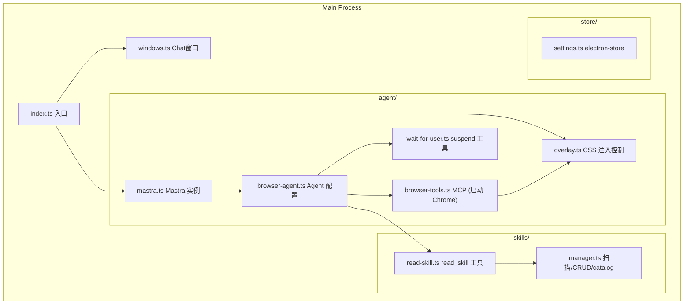
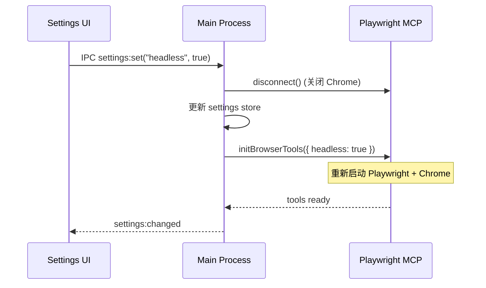

# 计划二：Electron 后端（Main Process）设计

> 本文档聚焦 Main Process 内的所有后端逻辑：Agent 集成、MCP 客户端、Overlay、Skills 和进程管理。

---

## 一、后端架构总览

Main Process 负责：
1. **Chat 窗口管理** — 单个 Electron BrowserWindow
2. **Agent 编排** — Mastra Agent 初始化与调用
3. **浏览器控制** — Playwright MCP 默认模式启动独立 Chrome
4. **视觉指示** — Overlay CSS 注入 (`--init-script` + `browser_evaluate`)
5. **人机协作** — wait_for_user (suspend/resume)
6. **Skills 系统** — Catalog 索引 + read_skill 按需加载
7. **设置持久化** — electron-store



---

## 二、目录结构

```
src/main/
├── index.ts                  # 应用入口, protocol.handle 注册
├── windows.ts                # Chat 窗口管理 (单窗口)
├── ipc/
│   └── settings.ts           # 设置变更 IPC handler
├── agent/
│   ├── mastra.ts             # Mastra 实例
│   ├── browser-agent.ts      # Agent 配置 (instructions, tools, memory, autoResume)
│   ├── browser-tools.ts      # Playwright MCP 客户端 (默认模式, 启动独立 Chrome)
│   ├── overlay.ts            # Overlay CSS 注入控制 (browser_evaluate)
│   └── wait-for-user.ts      # suspend() 工具定义
├── skills/
│   ├── manager.ts            # SkillManager
│   ├── read-skill.ts         # read_skill 工具
│   └── types.ts              # SkillMeta
├── session/                  # (预留)
└── store/
    └── settings.ts           # electron-store
```

项目根目录另有 `overlay-init.js`，作为 `--init-script` 参数传给 MCP。

---

## 三、技术选型

| 模块 | 技术 | 理由 |
|------|------|------|
| Agent 框架 | Mastra (@mastra/core) | Agent/Tool/Memory，底层 AI SDK |
| LLM 调用 | agent.stream() → DataStream | 与 Renderer useChat 天然兼容 |
| 浏览器自动化 | @playwright/mcp (默认模式) | **直接启动 Chrome，开箱即用**，零额外配置 |
| Overlay | --init-script + browser_evaluate | 官方支持，导航后自动重注入 |
| 人机协作 | Mastra suspend() + autoResumeSuspendedTools | 原生语义恢复 |
| 持久化(设置) | electron-store | 轻量 JSON |
| 持久化(对话) | LibSQL (Mastra Memory) | Memory 默认后端 |
| 进程管理 | Electron lifecycle hooks | before-quit 清理 Chrome 进程 |

---

## 四、Agent 设计

### 4.1 Mastra 实例 (`mastra.ts`)

```typescript
import { Mastra } from "@mastra/core";
import { browserAgent } from "./browser-agent";

export const mastra = new Mastra({
  agents: { browserAgent },
});
```

### 4.2 Browser Agent 配置 (`browser-agent.ts`)

```typescript
import { Agent } from "@mastra/core/agent";
import { Memory } from "@mastra/memory";

export const browserAgent = new Agent({
  id: "browser-agent",
  name: "Browser Agent",
  model: openai("gpt-4.1"),
  tools: { ...browserTools, waitForUserTool, readSkillTool },
  memory: new Memory(),
  defaultOptions: {
    maxSteps: 50,
    autoResumeSuspendedTools: true,
  },
  instructions: `...
## Human-in-the-Loop
When you detect any of these situations, call wait_for_user INSTEAD of trying to automate:
- Login page requiring credentials
- CAPTCHA or 2FA verification
- OAuth/SSO redirect flows
- File picker dialogs (OS-native)
- Any scenario requiring sensitive personal information

After wait_for_user resumes, ALWAYS call browser_snapshot to see the updated page state.

## Skills Usage
A catalog of available skills is listed at the end of your instructions.
When a user's request matches a skill, call read_skill(skillId) BEFORE starting browser actions.
Do NOT guess skill content — always read first.
...`,
});
```

### 4.3 Agent 调用入口

Agent 通过 `protocol.handle` 被调用（详见通信计划）：

```typescript
const result = agent.stream(messages, {
  maxSteps: 50,
  threadId: effectiveThreadId,
  resourceId: "desktop-user",
  instructions: agent.instructions + catalog,
  onStepFinish: async (event) => {
    await overlayController.handleStep(event);
  },
});
return result.toDataStreamResponse();
```

---

## 五、Playwright MCP 客户端 (`browser-tools.ts`)

### 5.1 核心设计 — 默认模式，直接启动 Chrome

与 Cursor / Antigravity 完全相同的使用方式。MCP 自行管理 Chrome 进程和 profile。

```typescript
import { MCPClient } from "@mastra/mcp";
import path from "path";

let mcpClient: MCPClient | null = null;
let tools: Record<string, any> = {};

const overlayInitScript = path.join(__dirname, "../../overlay-init.js");

export async function initBrowserTools(config: BrowserConfig) {
  if (mcpClient) await mcpClient.disconnect();

  const args = [
    "-y",
    "@playwright/mcp@latest",
    "--browser", config.browser || "chrome",
    "--caps", "vision",
    "--init-script", overlayInitScript,
  ];
  if (config.headless) args.push("--headless");
  if (config.userDataDir) args.push("--user-data-dir", config.userDataDir);
  if (config.executablePath) args.push("--executable-path", config.executablePath);

  mcpClient = new MCPClient({
    id: "playwright-browser",
    servers: { playwright: { command: "npx", args } },
  });

  tools = await mcpClient.listTools();
  return tools;
}

export function getMCPClient() { return mcpClient; }
export function getBrowserTools() { return tools; }
```

### 5.2 关键参数

| 参数 | 作用 |
|------|------|
| `--browser chrome` | 使用系统安装的 Chrome |
| `--caps vision` | 启用截图能力 |
| `--init-script overlay-init.js` | **每个页面自动注入 overlay CSS** |
| `--headless` | 无头模式 (可选) |
| `--user-data-dir` | 持久化 profile (保留登录态) |
| `--executable-path` | 指定 Chrome 路径 (可选) |

### 5.3 BrowserConfig

```typescript
interface BrowserConfig {
  browser: "chrome" | "firefox" | "webkit";
  headless: boolean;
  userDataDir?: string;
  executablePath?: string;
}
```

### 5.4 Headless 模式切换

切换 headless 需要**重建 MCP 客户端**（Playwright MCP 在启动时确定模式）：



---

## 六、Overlay — `--init-script` + `browser_evaluate`

### 6.1 设计思路

利用 `@playwright/mcp` 官方的 `--init-script` 功能：脚本会在**每个页面加载前**自动执行（包括导航后的新页面）。这解决了 CSS 注入在导航后丢失的问题。

`onStepFinish` 中通过 `browser_evaluate` 动态切换 overlay 的模式（自动执行 / 等待用户 / 隐藏）。

### 6.2 视觉状态

| 状态 | 边框颜色 | 顶栏文案 | 触发 |
|------|----------|----------|------|
| `automating` | 蓝色 (#3B82F6) 脉冲 | "AI Agent 自动执行中..." | Agent 执行浏览器操作 |
| `waiting` | 橄榄绿 (#6B8E23) 呼吸 | 等待原因文案 | Agent 调用 wait_for_user |
| `hidden` | 无 | 无 | Agent 完成 / 空闲 |

### 6.3 `overlay-init.js` — 每个页面自动注入

```javascript
// overlay-init.js — 通过 --init-script 注入每个页面
// 此脚本在页面的任何 JS 执行前运行, 包括导航后的新页面

window.__agentOverlay = {
  _mode: 'hidden',

  show(mode, text) {
    this._mode = mode;
    const p = mode === 'waiting'
      ? { bg: '#6B8E23', border: '#6B8E23' }
      : { bg: '#3B82F6', border: '#3B82F6' };

    let style = document.getElementById('__agent_style');
    if (!style) {
      style = document.createElement('style');
      style.id = '__agent_style';
      document.head.appendChild(style);
    }
    style.textContent = `
      @keyframes __agentPulse { 0%,100%{opacity:1} 50%{opacity:.6} }
      #__agent_bar {
        position:fixed; top:0; left:0; right:0; height:28px;
        z-index:2147483647; background:${p.bg};
        display:flex; align-items:center; padding:0 10px; gap:6px;
        font:12px/28px system-ui; color:#fff; pointer-events:none;
      }
      #__agent_bar .dot {
        width:6px;height:6px;border-radius:50%;background:#fff;
        animation:__agentPulse 1.5s ease-in-out infinite;
      }
      #__agent_frame {
        position:fixed; inset:0; z-index:2147483646;
        border:3px solid ${p.border};
        animation:__agentPulse 2s ease-in-out infinite;
        pointer-events:none;
      }
    `;
    document.body.style.marginTop = '28px';

    let bar = document.getElementById('__agent_bar');
    if (!bar) {
      bar = document.createElement('div');
      bar.id = '__agent_bar';
      bar.innerHTML = '<span class="dot"></span><span class="text"></span>';
      document.body.appendChild(bar);
    }
    bar.querySelector('.text').textContent = text || 'AI Agent 自动执行中...';

    if (!document.getElementById('__agent_frame')) {
      const frame = document.createElement('div');
      frame.id = '__agent_frame';
      document.body.appendChild(frame);
    }
  },

  hide() {
    this._mode = 'hidden';
    document.getElementById('__agent_style')?.remove();
    document.getElementById('__agent_bar')?.remove();
    document.getElementById('__agent_frame')?.remove();
    document.body.style.removeProperty('margin-top');
  }
};
```

### 6.4 Overlay Controller (`overlay.ts`)

```typescript
export class OverlayController {
  private mcpClient: MCPClient;

  async showAutomating() {
    await this.evaluate(`window.__agentOverlay?.show('automating')`);
  }

  async showWaiting(reason: string) {
    await this.evaluate(`window.__agentOverlay?.show('waiting','${reason}')`);
  }

  async hide() {
    await this.evaluate(`window.__agentOverlay?.hide()`);
  }

  async handleStep(event: StepEvent) {
    for (const call of event.toolCalls ?? []) {
      if (call.toolName === "wait_for_user" && call.type === "tool-call") {
        await this.showWaiting(call.args.reason);
        return;
      }
    }
    if (event.toolCalls?.length) {
      await this.showAutomating();
    }
  }

  private async evaluate(code: string) {
    await this.mcpClient.callTool("playwright", "browser_evaluate", {
      expression: code,
    });
  }
}
```

### 6.5 `--init-script` 的关键优势

| 维度 | 手动 onStepFinish 重注入 | `--init-script` (当前方案) |
|------|------------------------|---------------------------|
| 导航后恢复 | 需检测 browser_navigate 后手动重注入 | **自动**，Playwright 在每个新页面执行前注入 |
| 实现 | 在 onStepFinish 中判断导航工具 | **一个 JS 文件 + 一个 CLI 参数** |
| 覆盖范围 | 仅 Agent 触发的导航 | 所有导航（包括用户手动点击链接） |

---

## 七、wait_for_user 工具 (`wait-for-user.ts`)

（与之前设计相同，使用 Mastra 原生 suspend/resume，详见原计划）

```typescript
export const waitForUserTool = createTool({
  id: "wait_for_user",
  description: `Pause automation and wait for user action in the browser...`,
  inputSchema: z.object({
    reason: z.string().describe('Brief explanation, e.g. "请完成登录操作"'),
  }),
  outputSchema: z.object({
    completed: z.boolean(),
    userMessage: z.string().optional(),
  }),
  suspendSchema: z.object({ reason: z.string(), waitingFor: z.string() }),
  resumeSchema: z.object({ userMessage: z.string().optional() }),
  execute: async (input, context) => {
    const { resumeData, suspend } = context?.agent ?? {};
    if (!resumeData) {
      return suspend?.({ reason: input.reason, waitingFor: "user_action" });
    }
    return { completed: true, userMessage: resumeData.userMessage ?? "用户操作完成" };
  },
});
```

---

## 八、Skills 系统

（与之前设计相同：Catalog 索引 + read_skill 按需加载，详见原计划）

核心流程：
1. 启动时 `SkillManager.scanAll()` 读取 `~/.browser-agent/skills/` 下所有 SKILL.md 的 name + description
2. 构建轻量 catalog 注入 system prompt
3. Agent 推理时调用 `read_skill(skillId)` 按需加载完整内容

---

## 九、Settings Store

```typescript
interface AppSettings {
  model: {
    provider: string;
    name: string;
    apiKey: string;
  };
  browser: {
    headless: boolean;
    browser: "chrome" | "firefox" | "webkit";
    executablePath?: string;
    userDataDir?: string;
  };
  skills: {
    directory: string;
  };
}
```

---

## 十、进程清理与错误处理

### 10.1 Graceful Shutdown

```typescript
app.on('before-quit', async () => {
  await mcpClient?.disconnect();
  // Playwright MCP disconnect 会自动关闭它启动的 Chrome 进程
});
```

### 10.2 错误边界

| 错误场景 | 处理 |
|----------|------|
| MCP 连接失败 | 重试 + 通知 Renderer |
| Chrome 进程崩溃 | MCP 检测断开 → 尝试重建 → 通知用户 |
| LLM API 超时 | DataStream 错误事件 → useChat error 状态 |
| Skill 目录不存在 | 自动创建 + 空 catalog |
