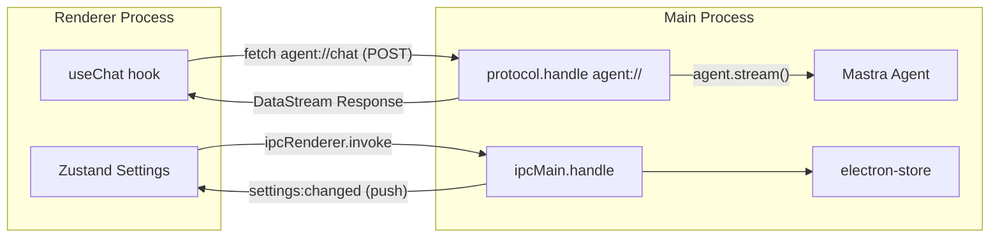

# 计划四：Electron 通信设计

> 本文档聚焦 Renderer ↔ Main Process 的通信机制：自定义协议、IPC、Preload 桥接。

---

## 一、通信架构总览

| 路径 | 机制 | 用途 | 数据格式 |
|------|------|------|----------|
| **聊天流** | `protocol.handle` (agent://) | 消息发送 + 流式响应 | AI SDK DataStream |
| **设置管理** | IPC (`ipcMain.handle` + `ipcRenderer.invoke`) | 设置读写 + 变更通知 | JSON |



**设计原则**：
- 聊天走 `protocol.handle`，不走 IPC，不走 localhost HTTP
- 设置走 IPC
- 人机协作 suspend/resume 走正常聊天流，无 IPC 侧信道

---

## 二、protocol.handle — 自定义协议 (agent://)

### 2.1 协议注册

```typescript
// main/index.ts — app.ready 之前
protocol.registerSchemesAsPrivileged([
  {
    scheme: "agent",
    privileges: { standard: true, supportFetchAPI: true, stream: true },
  },
]);
```

### 2.2 Handler

```typescript
app.whenReady().then(() => {
  protocol.handle("agent", async (request) => {
    const url = new URL(request.url);

    if (url.pathname === "/chat" && request.method === "POST") {
      const { messages, threadId } = await request.json();
      const agent = mastra.getAgent("browserAgent");
      const catalog = skillManager.buildCatalog(await skillManager.scanAll());

      const result = agent.stream(messages, {
        maxSteps: 50,
        threadId: threadId ?? crypto.randomUUID(),
        resourceId: "desktop-user",
        instructions: agent.instructions + catalog,
        onStepFinish: async (event) => {
          await overlayController.handleStep(event);
        },
      });

      return result.toDataStreamResponse();
    }

    return new Response("Not Found", { status: 404 });
  });
});
```

### 2.3 Renderer 端

```typescript
const { messages, ... } = useChat({
  api: 'agent://chat',
  maxSteps: 50,
  body: { threadId },
});
```

---

## 三、AI SDK DataStream 协议

| Chunk 类型 | 说明 | 触发时机 |
|------------|------|----------|
| `text-delta` | 文本增量 | Agent 输出文字 |
| `tool-call` | 工具调用请求 | Agent 调用工具 |
| `tool-result` | 工具调用结果 | 工具执行完成 |
| `finish` | 流结束 | Agent 完成或暂停 |
| `error` | 错误 | 异常 |

**Suspend 行为**：
1. `tool-call` chunk (wait_for_user, state: "call")
2. Agent 输出 `text-delta` 告知等待原因
3. `finish` chunk, `finishReason: 'suspended'`

---

## 四、IPC — 设置管理

### 4.1 Channels

| Channel | 方向 | 方法 | 参数 | 返回 |
|---------|------|------|------|------|
| `settings:get` | R→M | invoke | — | AppSettings |
| `settings:set` | R→M | invoke | key, value | void |
| `settings:changed` | M→R | send | AppSettings | — |

### 4.2 Handler

```typescript
export function setupSettingsIPC(mainWindow: BrowserWindow) {
  ipcMain.handle("settings:get", () => settingsStore.getAll());

  ipcMain.handle("settings:set", async (_event, key: string, value: unknown) => {
    settingsStore.set(key, value);

    // Browser 配置变更 → 重建 MCP 客户端 (关闭旧 Chrome → 启动新 Chrome)
    if (key.startsWith("browser.")) {
      await initBrowserTools(settingsStore.get("browser"));
    }

    mainWindow.webContents.send("settings:changed", settingsStore.getAll());
  });
}
```

---

## 五、Preload — contextBridge

### 5.1 实现

```typescript
// preload/index.ts
const api = {
  settings: {
    get: () => ipcRenderer.invoke("settings:get"),
    set: (key: string, value: unknown) =>
      ipcRenderer.invoke("settings:set", key, value),
    onChanged: (cb: (settings: AppSettings) => void) =>
      ipcRenderer.on("settings:changed", (_e, s) => cb(s)),
  },
};
contextBridge.exposeInMainWorld("electronAPI", api);
```

### 5.2 暴露面

聊天**不通过** preload。`useChat` 直接 `fetch('agent://chat')`，由 `protocol.handle` 处理。Preload 仅暴露设置相关 API。

---

## 六、人机协作通信流

**完全走正常聊天路径**，无 IPC 侧信道。

### 6.1 Suspend

```
用户发送消息 → useChat fetch agent://chat
→ protocol.handle → agent.stream()
→ Agent 调用 wait_for_user → suspend()
→ onStepFinish → overlayCtrl.showWaiting() (browser_evaluate 切换 CSS)
→ stream 结束 (finishReason: suspended)
→ DataStream 返回 → useChat 更新 messages
→ UI 显示 WaitCard + QuickActions
```

### 6.2 Resume

```
用户输入 "登录好了" 或点击 "继续执行"
→ useChat 发送新消息 fetch agent://chat
→ protocol.handle → agent.stream(同 threadId)
→ autoResumeSuspendedTools 自动恢复 wait_for_user
→ Agent 继续执行后续工具调用
→ overlayCtrl.showAutomating()
→ 完成后 overlayCtrl.hide()
```

---

## 七、Overlay 通信

Overlay 状态切换在 Main Process 内部通过 `onStepFinish` 回调处理，**不涉及 Renderer**：

```
Agent stream → onStepFinish → OverlayController
→ MCPClient.callTool("playwright", "browser_evaluate", ...)
→ Chrome 页面内 CSS 更新
```

Overlay 与 Renderer 无直接通信。

---

## 八、安全设计

| 措施 | 说明 |
|------|------|
| 无 HTTP 端口 | protocol.handle 不暴露网络端口 |
| contextBridge 隔离 | Renderer 无法直接访问 Node.js |
| 最小 preload API | 仅暴露 settings |
| agent:// 白名单 | 仅应用内可用 |

```typescript
const mainWindow = new BrowserWindow({
  webPreferences: {
    preload: path.join(__dirname, '../preload/index.js'),
    sandbox: true,
    contextIsolation: true,
    nodeIntegration: false,
  },
});
```

---

## 九、接口一览

### agent:// 协议

| 路径 | 方法 | 请求体 | 响应 |
|------|------|--------|------|
| `agent://chat` | POST | `{ messages, threadId }` | DataStream |

### IPC

| Channel | 方向 | 参数 | 返回 |
|---------|------|------|------|
| `settings:get` | R→M | — | AppSettings |
| `settings:set` | R→M | key, value | void |
| `settings:changed` | M→R | AppSettings | — |

### 内部通信 (Main Process 内)

| 路径 | 说明 |
|------|------|
| `agent.stream() → onStepFinish` | Agent 步骤完成回调 |
| `onStepFinish → OverlayController → browser_evaluate` | Overlay CSS 状态切换 |
| `settingsStore → initBrowserTools` | 设置变更触发 MCP 重建 |
